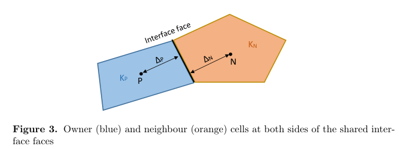
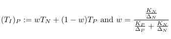
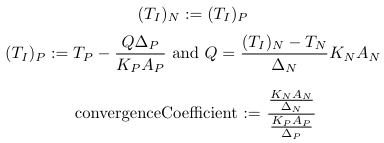

# Custom coupled interface conditions

This repo implements two coupled temperature boundary conditions for heat transfer. Coupling is acheived using [MUI](https://github.com/MxUI/MUI) to communicate between solvers.

These boundary conditions can be built locally and used like any other OpenFOAM patch type, simply add them to the desired patch in 0/T (see Usage for more detailed instructions).

## Boundary Conditions

Let $P$ be the owner cell and $N$ be the neigbouring cell. The respective temperatures in the cell centres are $T_P$ and $T_N$. They share an interface with temperature $T_I$.

<p align="center">
  
</p>


### Linear Interpolation

This is the simplest interface condition, we enforce the same Dirichlet boundary condition on both sides of the interface. Namely:
<p align="center">
  
</p>

This is a weighted average of $T_P$ and $T_N$ based on Thermal Conductivty $K$ and distance to the interface $\Delta$. This is implemented in OpenFOAM by extending the [mixed patch type](https://www.openfoam.com/documentation/guides/latest/doc/guide-bcs-mixed.html) and is used in many coupled solvers such as chtMultiRegionFoam. More information on this interface condition can be found [here](https://journal.openfoam.com/index.php/ofj/article/view/92/156) and on Page 44 of [Numerical Heat Transfer and Fluid Flow](https://catatanstudi.wordpress.com/wp-content/uploads/2010/02/numerical-heat-transfer-and-fluid-flow.pdf) by Suhas Patankar.

### Neumann-Dirichlet

Here we impose a Dirichlet Condition (fixedValue) on one side and Neumann Condition (fixedGradient) on the other. Supposing $P$ was the side imposing the Neumann Condition we would have:

<p align="center">
  
</p>

Here the superscript denotes the iteration number the given temperature is from.

Each side decides which kind of condition it will impose based on the convergenceCoefficient variable. If the the Neumann side has a convergenceCoefficient greater than 1 we will get blow up since we recursively multiply by the convergenceCoefficient. Since one side must have a convergenceCoefficient smaller than 1 we always set this side to impose the Neumann Condition.

## Building
Dependency management is done via [spack](https://spack.io/). To use the existing build system you must have an active spack environment with mui and mpi installed. Alternatively you can manually edit Make/options to have the include path for your local mpi and mui installation. If you have spack activated simply run:
```bash
git submodule intit
git submodule update
./build.sh
```

## Usage
Add the following line to your controlDict. Then use the patch types as normal. The patch names are "customLinearInterpolationCoupledBoundary" and "customNeumannDirichletCoupledBoundary".

```c++
libs("liblibcustomCoupledBoundary.so")
```

To add the patch type to 0/T use the following format:
```
<patchName>
{   
    type            customNeumannDirichletCoupledBoundary;
    kappaMethod     solidThermo;
    value           uniform 273.15;
}
```